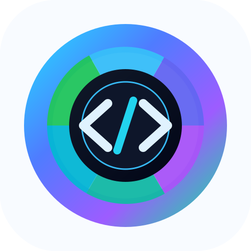

<p align="center">
  
</p>

<h1 align="center">OpenCode Chromium Browser Plugin</h1>

<p align="center">
  <strong>Browser automation for Chromium-based browsers, built from readable source instead of a closed browser bundle.</strong>
</p>

<p align="center">
  <a href="#why">Why</a> •
  <a href="#features">Features</a> •
  <a href="#supported-browsers">Browsers</a> •
  <a href="#requirements">Requirements</a> •
  <a href="#setup-on-windows">Windows Setup</a> •
  <a href="#setup-on-macos">macOS Setup</a> •
  <a href="#diagnostics">Diagnostics</a> •
  <a href="#troubleshooting">Troubleshooting</a> •
  <a href="#how-it-works">Architecture</a> •
  <a href="#security-notes">Security</a> •
  <a href="#development">Development</a> •
  <a href="#license">License</a>
</p>

---

## Why

Codex ships a Chrome browser integration that is **closed source** and tied to Chrome. That is not a great fit if you want browser automation that you can inspect, modify, and use across Chromium-family browsers.

> Also, if my browser starts quietly pulling down a full AI model in the background, that browser is not working for me anymore. I want a browser stack that stays lean, transparent, and under user control.

This repository rebuilds the integration around Chromium APIs, native messaging, and **OpenCode-native tools**. No proprietary blobs, no vendor lock-in.

---

## Features

- **Manifest V3 Chromium extension** — Tab management, CDP execution, screenshots, downloads, cursor overlays, console/network logs.
- **Readable Node.js native messaging host** — Bridges the browser extension to OpenCode via local IPC.
- **OpenCode plugin & skill** — 42+ browser automation tools exposed to your AI agents.
- **Multi-browser** — Works with Chrome, Edge, Brave, Chromium, and other Chromium-based browsers.

---

## Supported Browsers

| Browser   | Support |
|-----------|---------|
| Google Chrome | ✅ Full |
| Microsoft Edge | ✅ Full |
| Brave | ✅ Full |
| Chromium | ✅ Full |
| Other Chromium browsers | ✅ (if `chrome.debugger` + native messaging) |
| **Firefox** | ⏳ Coming (blocked on CDP support) |

---

## Requirements

- [Node.js](https://nodejs.org/) 20 or newer
- npm
- [OpenCode](https://opencode.ai)
- A Chromium-based browser (Chrome, Edge, Brave, etc.)

---

## Setup On Windows

1. **Install dependencies**

   ```powershell
   npm install
   ```

2. **Load the extension**

   - Open your browser's extensions page (`chrome://extensions`, `edge://extensions`, etc.)
   - Enable **Developer mode**
   - Click **Load unpacked**
   - Select this repository's `extension/` folder
   - Copy the generated extension ID

3. **Install the native messaging host**

   ```powershell
   npm run install:native-host -- --extension-id <extension-id> --browsers chrome
   ```

   Or auto-detect for all installed browsers:

   ```powershell
   npm run install:native-host -- --auto --browsers all
   ```

4. **Restart OpenCode** from this repository directory so it picks up `.opencode/plugins/chromium-browser.js` and `.opencode/skills/chromium-browser/SKILL.md`.

---

## Setup On macOS

1. **Install dependencies**

   ```bash
   npm install
   ```

2. **Load the extension**

   - Open your browser's extensions page (`chrome://extensions`, `edge://extensions`, etc.)
   - Enable **Developer mode**
   - Click **Load unpacked**
   - Select this repository's `extension/` folder
   - Copy the generated extension ID

3. **Install the native messaging host**

   ```bash
   npm run install:native-host -- --extension-id <extension-id> --browsers chrome
   ```

   Or auto-detect for all installed browsers:

   ```bash
   npm run install:native-host -- --auto --browsers all
   ```

4. **Restart OpenCode** from this repository directory.

---

## Diagnostics

```bash
# Full check (plugin validation + tests)
npm run check

# List detected browsers
npm run list:browsers

# Check native host registration
npm run check:native-host -- --json

# Check whether the extension is installed in a browser profile
npm run check:extension -- --browser chrome --extension-id <extension-id>
```

Once set up, run `browser_status` in OpenCode to verify connectivity.

---

## Troubleshooting

- **`browser_status` cannot reach host** — Reload the unpacked extension and reinstall the native host manifest with the current extension ID.
- **Extension not detected** — Make sure you're checking the right browser profile. Pass `--browser edge` or `--browser brave` as needed.
- **File upload blocked** — Open the extension details page and enable **Allow access to file URLs**.
- **Changes not taking effect** — If the browser was already running while you changed native messaging manifests, restart it.

---

## How It Works

```text
OpenCode tools
  -> local IPC (named pipe / unix socket)
  -> native-host/ (Node.js host bridge)
  -> Chromium native messaging
  -> extension/ (MV3 service worker)
  -> chrome.debugger + Chrome APIs
  -> browser tab
```

The native host is intentionally small and readable (~300 lines). The extension owns all browser access:
tab tracking, CDP execution, screenshots, downloads, cursor overlay, console logs, network events,
and session management.

---

## Repository Layout

```text
extension/         Chromium extension source (MV3, background, popup, content scripts)
native-host/       Native messaging host and IPC bridge (Node.js)
opencode-plugin/   OpenCode plugin source (client + tool definitions)
.opencode/         OpenCode plugin entrypoint + browser skill
scripts/           Setup and diagnostic helpers (install, check, find)
docs/              Architecture notes
assets/logo.svg    Repository logo
```

---

## Security Notes

This project gives OpenCode **powerful browser automation capabilities**. Read the source before
installing it, and only load the extension from a checkout you trust.

- The native host communicates **locally** via Chromium native messaging and a local IPC socket/pipe.
- The extension requests broad permissions (tabs, debugger, downloads, scripting, history, etc.)
  because browser automation requires them.
- No telemetry, no analytics, no remote connections.

---

## Development

```bash
# Run tests (native-host framing tests)
npm test

# Validate the OpenCode plugin shape
npm run check:opencode-plugin

# Start the native host directly for local debugging
npm run host
```

---

## License

MIT
